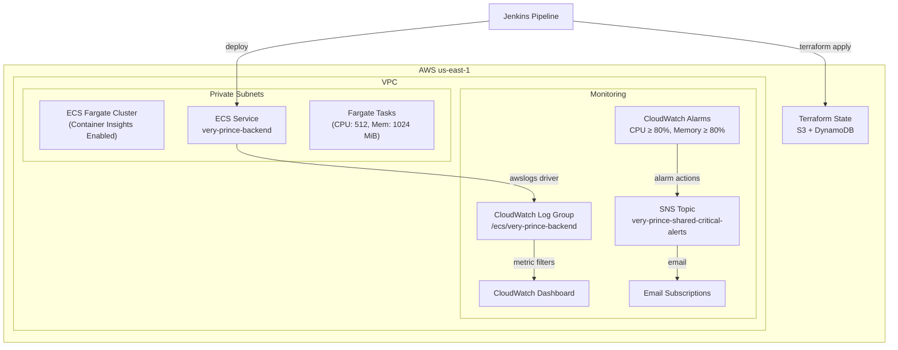

# Very-Prince Infrastructure Architecture

## Overview

This document describes the AWS infrastructure provisioned via Terraform for the very-prince backend service. The infrastructure enables CloudWatch log aggregation, metric alarms, dashboards, and SNS alert notifications for an ECS Fargate cluster.



## Components

### ECS Cluster (`terraform/modules/ecs-cluster/`)
- Fargate + Fargate Spot capacity providers
- Container Insights enabled for enhanced metrics
- Tagged with Project/Environment

### ECS Service (`terraform/modules/ecs-service/`)
- Task definition with `awslogs` log driver → CloudWatch Logs
- Execution role: CloudWatch Logs write + ECR pull
- Task role: Least-privilege application permissions
- Network: Private subnets + security group
- Optional ALB target group attachment

### CloudWatch Logs (`terraform/modules/cloudwatch-logs/`)
- Log group: `/ecs/very-prince-backend`
- 30-day retention (configurable)
- KMS encryption (AWS-managed)

### CloudWatch Alarms (`terraform/modules/cloudwatch-alarms/`)
- **CPU High**: `CPUUtilization ≥ 80%` for 2 × 60s periods
- **Memory High**: `MemoryUtilization ≥ 80%` for 2 × 60s periods
- Both route to SNS topic for notification

### CloudWatch Dashboard (`terraform/modules/cloudwatch-dashboard/`)
- Cluster CPU/Memory (stacked)
- Service CPU/Memory (lines)
- Task counts (running/pending/desired)
- Log ingestion volume & bytes

### SNS Topics (`terraform/modules/sns-topics/`)
- Topic: `very-prince-shared-critical-alerts`
- Email subscriptions from `alert_email_addresses` variable
- CloudWatch alarm publishing policy

## Data Flow

1. ECS tasks emit stdout/stderr → `awslogs` driver → CloudWatch Log Group
2. CloudWatch collects ECS CPU/Memory metrics automatically (Container Insights)
3. Alarms evaluate metrics every 60s; trigger SNS on threshold breach
4. SNS delivers to email subscribers (and any HTTPS/Lambda endpoints added manually)
5. Dashboard visualizes all metrics in single pane

## Jenkins Pipeline (`Jenkinsfile`)
- Declarative syntax
- Stages: Setup → Init → Validate → Plan → Apply (gated)
- OS detection: `isUnix()` → `sh` on Linux, `bat` on Windows
- Artifact: `tfplan` passed between Plan/Apply

## Windows Support
- `scripts/terraform-setup.ps1`: Chocolatey/Scoop/Zip install
- No WSL required
- Jenkins pipeline uses `bat` on Windows agents

## Operations

### Accessing Dashboard
```
https://us-east-1.console.aws.amazon.com/cloudwatch/home?region=us-east-1#dashboards:name=very-prince-shared-very-prince-backend
```

### Alarm Names
- `very-prince-very-prince-backend-cpu-high`
- `very-prince-very-prince-backend-memory-high`

### SNS Topic
- `very-prince-shared-critical-alerts`

### Log Group
- `/ecs/very-prince-backend`
